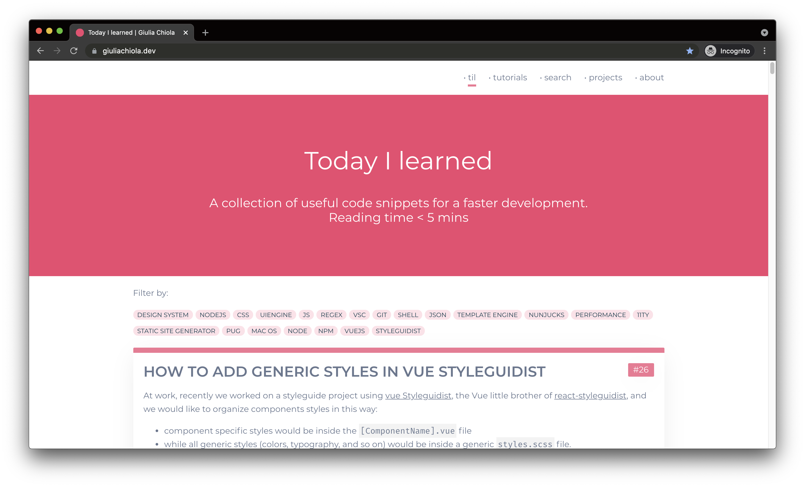

# Super blog 11ty

This project is my tech blog.

It is built using 11ty as static site generator and use other two repositories as git submodules.

| \                | \                                                                                                                                                                      |
|------------------|------------------------------------------------------------------------------------------------------------------------------------------------------------------------|
| Deploy status	         | [](https://app.netlify.com/sites/blog-giuliachiola/deploys) |
| Deploy preview   | https://giuliachiola.dev/                                                                                                                                              |
| Project typology | Personal                                                                                                                                                               |



## 🔥 Tech stack

| Purpose               | Technology                               |
|-----------------------|------------------------------------------|
| Templating            | Nujucks                                  |
| Styling               | SCSS + BEMIT                             |
| Documentation         | Markdown                                 |
| Static Site Generator | [11ty](https://github.com/11ty/eleventy) |

## 🌊 Run development mode

```shell
# pull submodules
git submodule update --init --recursive

# install dependencies
npm i

# serve with hot reload at localhost:8080
npm run dev
```

Note: if `npm i` throw an error, please check this [guide](docs/dependencies-error.md)

## 🧳 Build setup

```shell
# build for production
npm run build
```

## 📚 Project documentation

- project
  - [project submodules and branches](docs/project-submodules.md)
  - [project releases](docs/project-releases.md)
  - [dependencies errors](docs/project-dependencies.md)
  - [social images](docs/social-images.md)
- content
  - [content fields](docs/content-fields.md)
  - [content images and gifs](docs/content-images-gifs.md)
  - [content markup and styles](docs/content-markup.md)
- other
  - [debug 11ty](docs/debug-11ty.md)
  - [project table of contents](docs/table-of-contents.md)
  - [validators](docs/validators.md)

### 🌿 Branches

| Branch name | Use        |
|:------------|:-----------|
| `main`      | production |
| `develop`   | staging    |

### 🌿 Submodules Branches

**Super styleguide**

| Branch name | Use                                         |
|:------------|:--------------------------------------------|
| `main`      | production (also used by `super-blog-11ty`) |

**Super blog content**

| Branch name | Use                                         |
|:------------|:--------------------------------------------|
| `main`      | production (also used by `super-blog-11ty`) |
